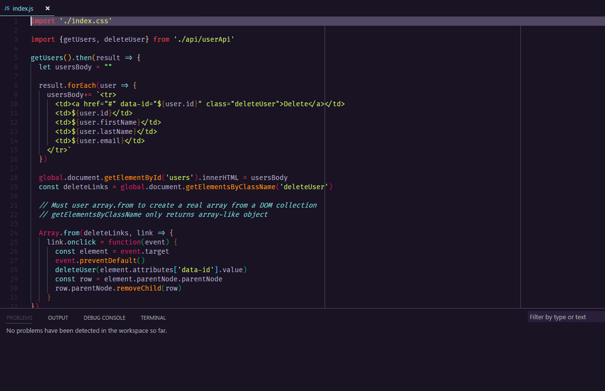

# Level Up Theme for VS Code

# Installation

1. Open the extensions sidebar on Visual Studio Code
2. Search for **Go Cats**
3. Click **Install** to install it.
4. Click **Reload** to reload the your editor
5. File > Preferences > Color Theme > **Go Cats**

### Otherwise

1. Launch Quick Open using `Ctrl+P` or `Cmd+P`
2. Paste the command `ext install theme-go-cats`
3. Follow the installation steps as above. 

## Thanks

Thanks to Scott Tolinski for creating the Level Up theme, which I forked to give me a starting point. Thanks also to Wes Bos for creating the Cobalt2 theme, which Scott forked to create Level Up.
